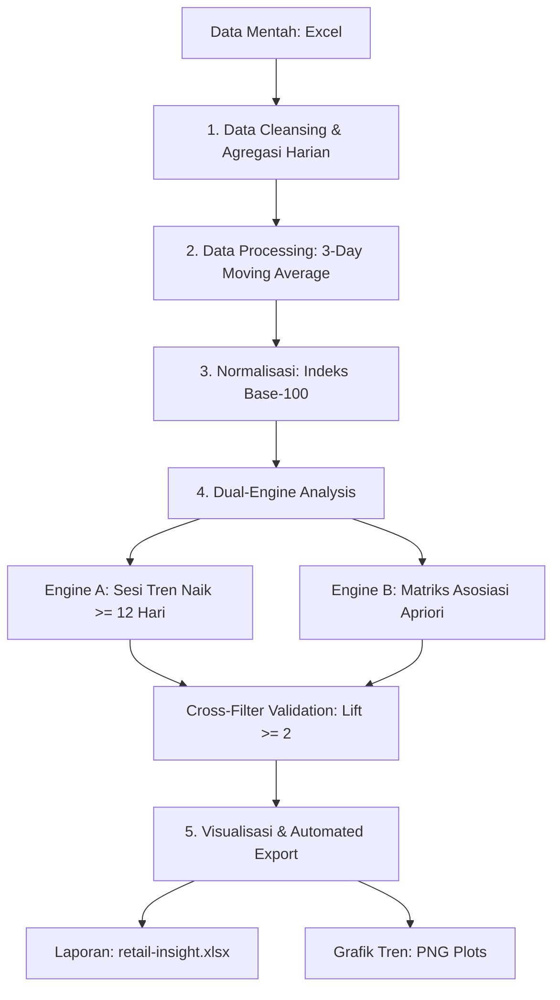
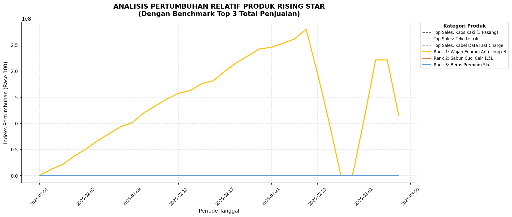

# 📊 Bangun Infrastruktur End-to-End Retail Data Pipeline: Time-Series Trend Detection & Market Basket Analysis

[](https://www.python.org)
[](LICENSE)


Anomali data harian dan fluktuasi pasar sering kali menyamarkan tren produk potensial yang sesungguhnya. Proyek ini membangun sebuah *End-to-End Data Pipeline* otomatis menggunakan Python untuk mengolah data *time-series* penjualan retail yang kompleks dan *noisy*. Sistem ini secara cerdas mengintegrasikan dua mesin analisis bisnis: **Trend Tracking (Moving Average)** untuk mendeteksi performa *Rising Star*, dan **Market Basket Analysis (Algoritma Apriori)** untuk merumuskan strategi paket produk (*product bundling*) berbasis keterikatan statistik yang kuat.

---

## 🎯 Masalah Bisnis & Dampak (Business Case)
* **Tantangan Data Mentah:** Log transaksi berskala besar sangat rentan terhadap data pencilan (*outliers*) akibat promosi sesaat, hari libur, atau kendala stok harian. Fluktuasi jangka pendek (*noise*) ini menyulitkan manajemen dalam mengidentifikasi pertumbuhan organik jangka panjang.
* **Kehilangan Peluang Penjualan:** Manajemen sering kali terlambat menyadari produk baru yang sedang populer (*Rising Star*), serta gagal mengoptimalkan penjualan silang (*cross-selling*) karena penyusunan paket produk (*bundling*) masih mengandalkan intuisi manual, bukan pembuktian empiris.
* **Solusi Proyek:** Pipeline ini mengeliminasi *noise* data melalui teknik *smoothing* berbasis waktu, menyaring produk dengan tren positif konsisten minimal 12 hari berturut-turut, dan secara otomatis merekomendasikan paket produk terbaik yang wajib melibatkan produk tren tersebut.

---

## 🛠️ Tech Stack & Library Python
Proyek ini mengutamakan efisiensi pemrosesan data menggunakan kombinasi pustaka berkinerja tinggi:
* **Pandas & NumPy:** Ingesti data, agregasi matriks multi-level, penanganan runtun waktu (*datetime*), kalkulasi jendela bergerak (*rolling window*), dan transformasi logika kondisional.
* **MLxtend (Apriori & Association Rules):** Ekstraksi pola keterkaitan item (*frequent itemsets*) dan kalkulasi parameter asosiasi (*Support, Confidence, Lift*).
* **Openpyxl:** Pembuatan *automated spreadsheet reporting* dari Python langsung ke format Excel korporat siap pakai.
* **Matplotlib:** Mesin visualisasi data untuk menghasilkan grafik multi-axis beresolusi tinggi (DPI 100) dengan kustomisasi palet warna berbasis peringkat.

---

## 🧬 Arsitektur & Framework Data Pipeline
Alur kerja pemrosesan data dirancang secara linear mengacu pada *Data Analytics Lifecycle Framework*:



Data Understanding & Cleansing: Membaca data log transaksi, penanganan tipe data penanggalan, dan melakukan agregasi total nilai penjualan harian per item produk.

Data Processing (Smoothing & Base-100): * Menggunakan 3-Day Moving Average (.rolling(window=3).mean()) guna meredam volatilitas harian agar tren utama terlihat jelas.Menerapkan Normalisasi Indeks (Base 100) untuk menyetarakan skala perbandingan laju pertumbuhan produk murah vs mahal secara adil.

Data Analysis (Dual-Engine):Engine 1 (Rising Star): Melacak performa krisis (crisis) dan pemulihan (recovery) tren lewat deteksi diferensiasi harian (.diff() > 0) menggunakan fungsi kustom rentetan berurutan.Engine 2 (Apriori):Mengubah data menjadi matriks One-Hot Encoding dan menyaring kombinasi dengan ambang batas Support $\ge$ 1%.

Cross-Filtering Validation: Aturan paket produk yang terbentuk secara ketat disaring kembali untuk memastikan kekuatan asosiasi yang mutlak (Nilai Lift $\ge$ 2.0) serta wajib mengandung minimum satu produk Rising Star.

Decision Making & Reporting: Pembuatan dokumen laporan final otomatis dan pembuatan grafik visualisasi tren pertumbuhan.📈 Visualisasi & Hasil Analisis (Artifacts)Pipeline ini secara otomatis mengekspor visualisasi data ke dalam direktori kerja untuk kebutuhan pelaporan manajemen:

1. Grafik Pertumbuhan Relatif (rising_star_index.png)Menampilkan pergerakan indeks pertumbuhan kumulatif (Base 100) produk-produk Rising Star terbaik yang disandingkan langsung dengan performa rata-rata dari Top 3 Sales toko sebagai tolok ukur (benchmark). Pewarnaan garis grafik menggunakan palet khusus berbasis medali peringkat (Emas, Perak, Perunggu).
2. Grafik Nilai Penjualan Riil (rising_star_actual.png)Memberikan konfirmasi validitas volume pendapatan kepada manajemen mengenai kontribusi nominal mata uang (Rupiah asli) dari produk-produk yang sedang naik daun tersebut terhadap total omzet bisnis harian.
3. Automated Spreadsheet Report (retail-insight.xlsx)Laporan terformat rapi yang mencakup dua lembar kerja (sheets): Rising Star dan Potential Packaging. Dilengkapi fungsi estetika otomatis seperti penyesuaian lebar kolom (auto-fit), penebalan kepala tabel (bold headers), pembekuan baris (freeze panes), serta standarisasi format desimal dan pemisah ribuan.

🚀 Cara Menjalankan Project (Local Setup)
Pastikan Anda memiliki lingkungan Python 3.8 atau versi di atasnya.

pergi ke Repositori:(https://github.com/harrisariefkamis/HACKATHON-Retail-Crisis-Recovery-Visualization-Challenge)

Pasang semua pustaka dependen yang dibutuhkan:

Bash
pip install pandas numpy matplotlib openpyxl mlxtend
Tempatkan berkas data transaksi Anda dengan nama data_penjualan.xlsx (pastikan struktur sheet bernama Transaksi) di dalam direktori utama.

Jalankan skrip pipeline:

Bash
python solusi_retail.py


💡 Key Insights & Strategi Bisnis Masa Depan
Aksi Taktis Bundling: Tim operasional toko dan pemasaran digital e-commerce dapat langsung menerapkan skema promo bundling fisik berdasarkan tabel Top 10 Packaging Recommendation yang terbukti memiliki nilai keterikatan belanja tinggi.

Alokasi Manajemen Inventaris: Memberikan sinyal proaktif bagi tim gudang (inventory) untuk segera menaikkan kapasitas stok pengaman (safety stock) terhadap produk pemenang Rank 1-3 demi mengantisipasi potensi kehilangan momentum penjualan akibat kehabisan barang (out-of-stock).

Subsidi Silang Pemasaran: Memanfaatkan profit margin yang stabil dari produk pokok (staple goods) ber-volume tinggi untuk mendanai biaya promosi produk Rising Star pasangannya, guna merebut pangsa pasar kompetitor secara agresif.

Proyek ini merupakan bagian dari portofolio profesional Data Analytics. Silakan hubungi saya melalui LinkedIn jika ada pertanyaan lebih lanjut terkait arsitektur pipeline ini.

***

### 💡 Tips Tambahan Sebelum Melakukan Push ke GitHub:
1. Ganti tautan `https://github.com/username-anda/nama-repo-anda.git` dengan URL repositori asli Anda.
2. Setelah Anda menjalankan skrip `solusi_retail.py` secara lokal dan berkas gambar `rising_star_index.png` serta `rising_star_actual.png` terbentuk, Anda bisa menyisipkan gambar tersebut ke dalam Markdown dengan menambahkan baris sintaks berikut di bawah deskripsi grafik masing-masing agar portofolio Anda semakin memikat secara visual:
   ```markdown
   
